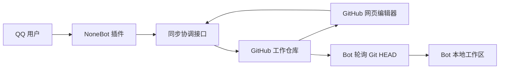

# QQ Bot ↔ GitHub 网页双向翻译同步：后续工作规划

## 1. 目标

实现以下闭环：

```text
QQ 用户提交文件
    ↓
NoneBot 插件接收、校验、提交 GitHub
    ↓
GitHub 工作仓库（唯一真源）
    ↓
网页读取/编辑，Bot 轮询并更新本地工作区
```

网页和 QQ Bot 不直接访问对方的本地目录。当前网页是静态 Vite 应用，浏览器无法直接复制文件到 Bot 机器，因此 GitHub 工作仓库必须承担共享存储和同步媒介的角色。

## 2. 必须先确定的设计原则

1. GitHub 工作仓库是唯一可写真源。
2. `records/<file_id>.json` 是单个文件的权威记录。
3. `records.csv` 和 Bot 的 `compare_status.csv` 只是生成的兼容视图。
4. GitHub Issue 继续用于认领和网页展示，但不再与记录文件并列作为完成状态真源。
5. 操作者记录保存 QQ 号；展示时按来源显示群内 ID 或 GitHub ID。
6. 鉴权只使用 QQ 号或 GitHub login，不使用群名片、昵称或显示文本。
7. 所有正式稿、备份、草稿、记录的变更必须一次提交完成。
8. 不实现“共享一个脏位并清空日志”。Git commit SHA 本身就是同步游标和变更日志。
9. **时间戳以 GitHub 记录为准**，格式统一为 UTC、秒级、`Z` 结尾（`2026-07-22T13:53:36Z`）。

### 时间戳规则（2026-07-22 确立）

- `records/<file_id>.json` 里的 `timestamp` 是完成时间的唯一真源，本地只是镜像。
- 本地与 GitHub 不一致时，**一律以 GitHub 覆盖本地**，不反向回写。
- 写入前先读 GitHub 当前记录，**只改本次动作涉及的那一轨**，其余字段原样带回。
- 已存在的时间戳**不因重新同步、重新导入或批量维护而刷新**；只有真的发生了新动作才更新。
- 只用 UTC、秒级、`Z`。不写本地时区偏移，不写微秒——`+08:00` 会让字符串比较把它误判成更晚的时刻。
- 网页展示取“文件最后提交”与“记录 `timestamp`”中较早者，且按时刻比较；这是为兼容历史上被批量操作污染的文件提交时间，不改变记录是真源这一点。

## 3. 部署环境和插件位置

两个 NoneBot 插件部署在同一台 NAS：

```text
SSH 主机：192.168.31.130
SSH 用户：pm

/volume1/docker/bingdu_wcnm/nonebot/src/plugins/nonebot_plugin_gakuen_csv_sync
/volume1/docker/bingdu_wcnm/nonebot/src/plugins/nonebot_plugin_hatsuboshi_resource_sync
```

部署规划：

1. `nonebot_plugin_gakuen_csv_sync` 负责翻译/校对文件、记录和 GitHub 双向同步。
2. `nonebot_plugin_hatsuboshi_resource_sync` 继续负责原文资源同步；需要复用统一的 `file_id`、版本和操作者映射。
3. 两个插件共享同一个配置目录、同步锁和 outbox 约定，避免同时写入同一份工作区文件。
4. SSH 密码、GitHub Token、OAuth Secret 只放 NAS 的环境变量或密钥文件，不写入本规划、Git 仓库或日志。
5. 上线前先在 NAS 复制两个插件目录和 `resources`，完成离线迁移演练，再切换正式轮询。

### 当前实施进度（2026-07-22，最近核对）

当前 GitHub 工作仓库 HEAD：`94958fda50fc713139fbed93a40158116c745d51`

| 项目 | 当前数量/状态 |
| --- | --- |
| GitHub Issue | 325 个（开放 66，关闭 259） |
| 已存档 Issue | 43 个（`closed` + `已存档` 标签） |
| `records/*.json` | 325 个 |
| 原文 TXT | 248 个 |
| 机翻 CSV | 110 个 |
| 翻译 CSV | 267 个 |
| 校对 CSV | 222 个 |
| 翻译/校对草稿 | 目前均为 0 个 |
| 翻译/校对备份 | 目前均为 0 个 |
| `source_times.json` | 尚未生成，需在管理页点一次“更新入库时间清单” |
| Bot 记录同步 | 325 个，指纹与 GitHub 相同，HEAD 已追平 |
| Bot 文件镜像 | `artifact_sync_complete=true`，847 个产物已追平 |

记录状态统计：翻译完成 265、校对完成 222、至少一轨有人认领 271。

Issue 数量从 332 回到 325：7 个历史“重复归档”工单为同一批次重复创建，与在册工单 body 完全相同，已确认可由维护者删除。

- [x] 阶段 0：完成本地源码核对，并备份 CSV 插件的 `__init__.py`、`config.py`、`registered_users.csv`。
- [x] 阶段 1：已增加 `work_protocol.py`、`resources/records/` 原子 JSON 记录层，并完成现有 `compare_status.csv` 记录迁移。
- [x] 阶段 1：已生成 `resources/records.csv` 兼容汇总，并在网页管理页增加 `users.json` 的 QQ 字段。
- [x] 身份对齐：已按完全匹配结果关联 5 个 GitHub login 与 QQ 号；记录保存 QQ 号，QQ 端显示群内 ID，网页端显示 GitHub ID。其余账号等待明确 QQ 映射，不按昵称猜测。
- [x] 阶段 2：已加入 `github_exchange.py` 只读镜像、HEAD/ETag 游标和“同步工作仓库”命令；公网仓库无需 Token 即可读取。
- [x] 阶段 2：已部署到 NAS，依据 NAS 自有数据生成 1450 条记录；`nonebot` 容器重启后成功加载插件。
- [x] 阶段 2：已从 GitHub 工作仓库同步 `index.json`、`users.json`、Issue 状态和 JSON 记录到 `resources/github-work/`；当前记录数量已追平至 325。
- [x] 阶段 2：匿名 API 达到限流后自动降级到 raw 文件 ETag；重复 HEAD 不重新下载，当前 NAS 实测第二次同步返回 `changed=false`。
- [x] 远程代码备份：`nonebot_plugin_gakuen_csv_sync/deploy_backups/phase2d-20260722-012807`。
- [x] 阶段 3：已加入 Git Data API 多文件提交器（文件 + `records/<file_id>.json`）和 CAS 分支冲突检测；NAS 已配置 Token 并开启写回。
- [x] 阶段 3：QQ 上传在写回开关关闭时保持原有本地流程；开启后会尝试同步到 GitHub，并明确报告写回失败。
- [x] 阶段 3 远程备份：`nonebot_plugin_gakuen_csv_sync/deploy_backups/phase3-20260722-013102`。
- [x] 阶段 3：已从 GitHub Issue 状态生成并提交 `records/<file_id>.json`；NoneBot 已按 JSON 语义对账并投影到本地记录。
- [x] 阶段 3：QQ 正式上传会在同一 Git 提交写入成品与记录 JSON，并更新 Issue 工序、操作者和 assignee。
- [x] 阶段 3：GitHub 已完成文件已投影为 Bot 可读取路径；`artifact_sync_complete` 已为 `true`，847 个产物全部追平。
- [x] 阶段 3：网页认领、直接上传、编辑器完成和 AI 完成路径会同步更新对应 `records/<file_id>.json`；身份字段和个人 ID 展示规则已统一。
- [x] 阶段 3：NAS 已再次重启验证，两个插件正常加载；HEAD `8155a8e4b3dfe3686441bada91a20b38e79861e7` 重复同步返回 `changed=false`。
- [x] 上传优先：QQ 与 GitHub 身份先按 `users.json` 归一化；同一人可直接提交，不同人上传先暂存，回复“确认覆盖”后才替换正式稿，回复“取消覆盖”则删除暂存稿。
- [x] 动态通知：Bot 每 60 秒轮询工作仓库；网页认领、翻译完成或校对完成会推送到既有 QQ 上传通知目标。
- [x] 身份补全：`GAKUKAKANG` 已绑定 QQ `871013773`，显示名为“框框”。
- [x] 历史冲突：经确认后，`adv_csprt-3-0104_01`～`03` 已由“框框 / GAKUKAKANG”覆盖翻译轨并补写 GitHub；文件、records、Issue 和 Bot 兼容记录已完成对账。
- [x] 镜像一致性：records 与成品按不可变 Git 提交 SHA 下载，避免 `raw.githubusercontent.com/main` 分支缓存返回旧内容。
- [x] 网页刷新优化：普通读取恢复缓存、首次用户/Issue 请求并行、历史提交时间改为不阻塞首屏、页面激活增加 30 秒防重复刷新；已推送并通过 GitHub Pages 部署。
- [x] 六类统一：网页和 Bot 均支持 `cidol`、`csprt`、`dear`、`event`、`pstory`、`pevent`；QQ 命令使用“培养事件”，并兼容误拼 `pevnet`。
- [x] 工作项对账：已补齐历史遗漏的 `pstory` Issue 和记录；当前 GitHub Issue 数量已扩展到 332，记录 JSON 为 325，另有 7 个重复归档 Issue 不对应业务记录。
- [x] `pevent` 首次同步：Bot 已写入 1101 个文件；上游六类清单为 `cidol 318 / csprt 493 / dear 455 / event 136 / pstory 608 / pevent 1101`。
- [x] CSV 同步提速：单类文件同步改为 8 路有限并发，`pevent` 首次全量同步实测约 107 秒完成。
- [x] QQ 认领联动：`翻译占坑`、`校对占坑` 同时更新 GitHub Issue 与 `records/<file_id>.json`；翻译认领优先发送 `ai_csv` 机翻稿，无机翻时回退原文 CSV。
- [x] 单端身份兼容：`users.json` 以必填且唯一的个人 ID 为键，GitHub ID 与 QQ 号至少填写一项；不再把 `qq-<QQ号>` 伪装成 GitHub ID。
- [x] 历史回填：`adv_dear_hski_037` 的校对稿已按 QQ `948279048` / “煉金術式”补写 Issue、JSON 记录、`users.json` 与校对 CSV。
- [x] 网页时间显示：工作台和已完成历史已补充原文、翻译、校对提交时间，并修复登录异步刷新时丢失时间的问题。
- [x] 阶段 5 前置：网页端已实现 Git Data API 多文件提交器 `OctokitWrapper.commitFiles`（blob → tree → commit → `force:false` 更新 ref）；422 直接报告分支已被推进，不做盲重试。
- [x] 历史回填：92 篇“翻译轨标记完成但仓库没有 `translated_csv`”的文件已用一次提交补齐。经 NAS 核对，Bot 本地 `csv/<file_id>.csv` 与 GitHub 校对稿逐字相同、`downloads/` 是无署名的机翻版，确认历史上不存在独立译文，故按校对稿内容补出翻译稿（tree 直接复用校对稿 blob，两份指向同一 Git 对象）。这批文件的“校对改了什么”信息本就不存在。
- [x] 完成时间口径：翻译/校对时间改为取“文件最后提交”与“记录 `timestamp`”中较早者。两个来源都被批量操作污染——回填出的文件时间偏晚，迁移过的记录时间也偏晚，取较早者才能同时避开。比较按时刻（`Date.parse`）而非字符串，因为有 33 条记录是 `+08:00` 带微秒格式。
- [x] 请求量优化：commit 时间进 `localStorage` 缓存（入库时间永久有效，完成时间按 issue `updated_at` 版本化）；完成时间只查当前页。已完成页从每次约 645 个请求降到冷缓存约 255、再次打开约 3 个。
- [x] 入库时间清单：新增 `source_times.json` 机制，读取端一个 raw 请求灌满缓存，写入端为管理页“更新入库时间清单”按钮；清单缺失或缺项时自动回退逐个查。
- [x] 网页分页：工作台、已完成、存档、个人记录按原文入库日分页（上一页/下一页 + `?d=` URL 页码）；管理页无入库时间数据且需要全量批量操作，明确不分页。批量操作使用筛选后全集而非当前页。
- [x] 个人记录页：新增 `/member`，按个人 ID 索引某人做过的全部文件，并给出全员统计（各成员完成量堆叠条、总量概览）。统计只计 `state === '完成'` 的轨道，工作台在途的不计入。
- [x] 译者署名行：完成翻译、完成校对、直接上传、AI 一键完成翻译时都会把成品 CSV 末行 `译者` 写成当前译者的个人 ID；管理页改译者时回写该文件的翻译稿与校对稿。校对完成沿用现有译者，不改成校对者。
- [x] 存档恢复归位：`restoreIssue` 按两轨状态决定 open/closed，两轨完成的恢复后进入已完成历史而不是工作台；4 个此前错位的工单已修正。
- [x] 数据修正：4 篇 `pevent` 的翻译轨由旧版“AI 署名”写成 `deepseek-v4-pro`，已按现行规则改回校对者 `klsddd`/`mk2`（Issue、CSV 署名行同步）。
- [x] 数据修正：10 篇 `adv_pstory_001_kllj_*` 的 Issue `proofread_path` 与记录 `artifacts.proofread_csv.path` 写成了 Bot 本地路径 `resources/csv/<file_id>.csv`，已改为仓库路径。此前若有人在这些工单点“校对完成”，成品会被写进仓库根下不存在的 `resources/csv/` 目录。
- [x] 代码修正：`displayUser` 传空值时会匹配上第一个 `github` 为空的成员（只填 QQ 的用户），把“无人认领”错认成该人；已加空值早退。记录 `category` 取 `artifactPath.split('/')[1]` 恒为 `adv`，已改为按 `file_id` 解析剧情类型（存量 110 条为旧的错值）。
- [x] 时间戳统一：GitHub 侧 33 处非 UTC 格式已全部归一为 `Z`；全库 325 条复查——格式非 `Z` 0、完成态缺时间戳 0、未来时间 0、待认领带操作者 0、artifacts 与轨道不一致 0。Bot 写入端也已改为 `Z`，13:53 写入的 76 条记录均为标准格式。
- [x] 两端一致性核对（HEAD `94958fd`）：GitHub 与 NAS 的 `records` 均为 325 条，按 `file_id｜翻译状态｜译者｜翻译时间｜校对状态｜校对者｜校对时间` 排序取 md5，两侧同为 `378a02e162c6b1cb6a4bcea0ae91d58d`，即 2275 个字段逐一相同；19 名成员的完成量逐人吻合。Bot 的 `artifact_sync_complete` 已为 `true`，`artifact_expected_count 847` 与 GitHub 的 `translated 267 + proofread 222 + ai 110 + raw_txt 248` 完全对上。
- [ ] 待验证：QQ 认领/上传这条常规路径写出的时间戳是否也已是 `Z`（最后一次样本 06:33 仍是 `+00:00` 带微秒，此后仅有维护脚本的写入样本）。
- [ ] 历史遗留（不处理）：`adv_dear_hmsz_026`、`adv_dear_ttmr_029` 的校对时间早于翻译时间，实为翻译在校对之后又提交了一次，校对稿可能基于旧译文。
- [x] 一次性导入遗留：10 条 `adv_pstory_001_kllj_*` 的 `resources/csv/` 路径来自 07-21 的历史导入而非 Bot 常规写入路径（同日 QQ 侧写入的路径均正确），已清理；若再次运行该导入脚本需先修其回退分支。
- [ ] 阶段 4：实现翻译/校对草稿保存、恢复和过期草稿提示；当前草稿目录和网页“中途保存”尚未实现。
- [ ] 阶段 5：在已有多文件提交器之上接入 `base_revision` CAS、正式稿/备份/草稿原子轮换和校对 TXT 更新；当前只有简单 `revision` 计数，网页完成仍走单文件 Contents API。
- [ ] 阶段 6：补齐 Bot 文件镜像失败重试和本地 outbox；记录与产物当前均已追平，但失败重试与断网恢复路径尚未验证。
- [ ] 阶段 7：清理旧流程，统一让 Issue 和 CSV 成为记录 JSON 的投影视图，并完成全量验收测试。

## 4. 推荐整体架构



推荐增加一个无状态同步接口（可部署为 Vercel Serverless Function）：

- 网页提交草稿/完成请求时调用接口。
- Bot 提交 QQ 文件时调用同一接口。
- 接口校验身份、版本和文件内容，然后执行一次 Git 多文件提交。
- 接口不保存业务数据库，GitHub 仍然是数据源。

如果所有网页用户都是目标仓库 collaborator，也可以让网页和 Bot 直接调用 Git Data API；但这样会重复实现冲突处理，且浏览器 OAuth Client Secret 不能继续暴露在前端。

## 5. GitHub 文件布局

沿用现有工作仓库目录，新增草稿、备份、记录和事件目录：

```text
raw_csv/<category>/<file_id>.csv
raw_txt/<file_id>.txt
ai_csv/<category>/<file_id>.csv

translated_csv/<category>/<file_id>.csv
translated_draft/<category>/<file_id>.csv
translated_backup/<category>/<file_id>.csv

proofread_csv/<category>/<file_id>.csv
proofread_draft/<category>/<file_id>.csv
proofread_backup/<category>/<file_id>.csv
proofread_txt/<file_id>.txt

records/<file_id>.json
events/YYYY-MM/<event_id>.json       # 可选，仅用于业务通知
users.json
```

`file_id` 必须是稳定、唯一、经过校验的标识，不能直接使用用户上传的原始文件名作为路径。

显式 `*_backup.csv` 只保留最新一份；Git 历史仍保留完整历史。

## 6. 记录结构

不建议让一个总 CSV 作为权威记录。不同文件同时提交时，所有操作都会争用同一个 CSV。推荐每个文件一个 JSON，随后生成总 CSV 供 Bot 和人工查看。

示例：

```json
{
  "schema_version": 1,
  "file_id": "adv_cidol-hume-3-018_03",
  "batch": "2026-07-21",
  "category": "cidol",
  "force_complete": {
    "translation": false,
    "proofread": false
  },
  "translation": {
    "revision": 4,
    "draft_revision": 2,
    "based_on_source_sha256": "..."
  },
  "proofread": {
    "revision": 1,
    "draft_revision": 0,
    "based_on_translation_revision": 4
  },
  "artifacts": {
    "source_csv": {
      "path": "raw_csv/cidol/adv_cidol-hume-3-018_03.csv",
      "operator_qq": "123456789",
      "operator_github": "",
      "display_id": "群内ID",
      "display_source": "qq",
      "timestamp": "2026-07-21T08:00:00Z",
      "sha256": "..."
    },
    "machine_csv": {
      "path": "ai_csv/cidol/adv_cidol-hume-3-018_03.csv",
      "operator_qq": "",
      "operator_github": "importer",
      "display_id": "importer",
      "display_source": "github",
      "timestamp": "2026-07-21T08:10:00Z",
      "sha256": "..."
    }
  }
}
```

需要记录的文件类型：

- 原文 CSV、原文 TXT
- 机翻 CSV
- 翻译 CSV、翻译草稿、翻译备份
- 校对 CSV、校对草稿、校对备份、校对 TXT

每个文件记录至少包含：路径、SHA-256、操作者、时间戳、来源版本。

### 操作者字段规则

- `operator_qq`：跨端关联和 Bot 鉴权使用的稳定字段。
- `operator_github`：网页提交时记录 GitHub login；QQ 提交时由 QQ↔GitHub 映射补齐。
- `display_id`：展示快照，可是群内 ID，也可是 GitHub 记录的 ID。
- `display_source`：`qq` 或 `github`。

显示字段变化不能修改历史操作者，也不能参与鉴权。

## 7. 版本和冲突规则

使用以下术语：

- `revision`：当前正式版本。
- `base_revision`：用户打开编辑器时加载的版本。
- `draft_revision`：草稿保存次数，不等于正式版本。

| 操作 | 条件 | 结果 |
| --- | --- | --- |
| 中途保存 | `base_revision == revision` | 写草稿，增加 `draft_revision`，正式版本不变 |
| 确认完成 | `base_revision == revision` | 正式稿移入备份，草稿晋升正式稿，清空草稿，`revision + 1` |
| 提交旧稿 | `base_revision < revision` | 保留为冲突草稿，不能覆盖正式稿，正式版本不增加 |
| 未来版本 | `base_revision > revision` | 拒绝，要求重新加载 |
| 内容哈希相同 | 任意合法请求 | 幂等成功，不增加版本 |

原需求中“旧版本写入草稿后继续把基准版本加一”会制造重复版本和伪更新，必须改为冲突草稿。

翻译和校对最好分别维护版本；校对记录额外保存 `based_on_translation_revision`。如果两条轨道同时修改频繁，再进一步按阶段拆分冲突锁。

## 8. 文件读取优先级

“正式文件优先于草稿”会导致已存在正式文件时永远打不开新草稿，因此需要区分编辑和只读。

### 翻译编辑

```text
当前操作者的有效草稿
→ 正式翻译 CSV
→ 机翻 CSV
→ 原文 CSV
```

### 校对编辑

```text
当前操作者的有效草稿
→ 正式校对 CSV
→ 正式翻译 CSV
→ 机翻 CSV
→ 原文 CSV
```

草稿只有在操作者匹配且 `based_on_revision == revision` 时自动恢复。过期草稿必须显示为冲突，不得静默覆盖。

## 9. QQ Bot → GitHub 流程

1. Bot 使用 QQ 号读取 `users.json` 映射，禁止使用群名片鉴权。
2. 收到文件后提取明确 `file_id`，拒绝模糊文件名。
3. 校验上传者是当前阶段认领人或管理员。
4. 校验扩展名、大小、UTF-8 编码、CSV 结构和行 ID。
5. 将文件先写入 Bot 本地临时目录并计算 SHA-256。
6. 根据 `base_revision` 判断正式提交还是冲突草稿。
7. 正式稿存在时，将旧正式稿复制为唯一备份。
8. 同一个 Git 事务写入文件、记录、备份和事件。
9. GitHub 失败时保留本地 outbox，返回“本地已接收，等待同步”。
10. 成功后更新本地 `compare_status.csv` 兼容缓存。

现有插件可复用：

- `_fetch_submit_file_bytes`：接收 QQ 文件。
- `sync_all_categories`：同步原文 CSV。
- `sync_adventure_txt_once`：同步原文 TXT。
- `_build_converted_txt_from_proofread_rows`：生成校对 TXT。
- `_sync_loop`：接入 GitHub 轮询。

## 10. 网页 → GitHub → Bot 流程

### 中途保存

- 点击“中途保存”。
- 只写 `translated_draft` 或 `proofread_draft`。
- 更新草稿操作者、时间、哈希和基准版本。
- 不修改正式完成状态。

### 确认完成

- 校验当前用户是否认领该阶段。
- 校验 `base_revision`。
- 旧正式稿→备份。
- 草稿/当前编辑内容→正式稿。
- 删除草稿。
- 更新记录、版本和校对 TXT。
- 一次 Git commit 完成所有文件变更。

### Bot 应用网页变化

1. Bot 轮询工作分支 HEAD。
2. HEAD 未变化则跳过。
3. HEAD 变化后读取记录和文件 SHA。
4. 文件先下载到 `.tmp`。
5. 校验 SHA-256。
6. 使用 `os.replace` 原子替换本地正式文件。
7. 更新本地记录和 `compare_status.csv`。
8. 所有文件成功后保存新的 `last_applied_commit_sha`。

## 11. 同步机制：取消共享脏位

不要实现以下模型：

```text
dirty = 1 → 消费者执行 → 清日志 → dirty = 0
```

它会造成并发覆盖、重复执行和崩溃丢事件。

推荐：

- Git branch HEAD SHA 作为脏位。
- Git commit history 作为日志。
- Bot 保存本地 `last_applied_commit_sha`。
- 网页在打开、获得焦点、保存前刷新 HEAD。
- 同一 SHA 或同一文件哈希重复处理时直接 no-op。

如果确实需要业务通知，再使用不可变事件文件：

```text
events/qq/<uuid>.json
events/web/<uuid>.json
```

事件不删除，每个消费者保存自己的游标。事件文件只负责通知，不能替代记录文件。

## 12. GitHub 写入方式

完成操作涉及多个文件：正式稿、备份、草稿删除、记录、校对 TXT、事件。因此不能继续使用多个独立 Contents API PUT。

应使用 Git Data API：

1. 读取当前 branch HEAD 和 tree。
2. 创建多个 blob。
3. 基于旧 tree 创建新 tree。
4. 创建 commit。
5. 使用旧 HEAD 非强制更新 branch ref。
6. 发生 409 时重新读取目标记录；目标版本没有变化才重试，否则报告冲突。

GitHub 官方文档说明，Contents API 的并发文件操作需要串行处理；Git Tree/Commit/Reference API 可以把多文件变更组织为一次提交，并在非强制更新引用时检测冲突：[Contents API](https://docs.github.com/en/rest/repos/contents)、[Git Trees](https://docs.github.com/en/rest/git/trees)、[Git References](https://docs.github.com/en/rest/git/refs)。

## 13. 身份和安全

统一身份文件：

```json
{
  "悸动": {
    "github": "kkdou3",
    "role": "user",
    "qq": ""
  },
  "煉金術式": {
    "github": "",
    "role": "user",
    "qq": "948279048"
  }
}
```

规则：

- 顶层键是必填、唯一的个人 ID。
- `github` 与 `qq` 至少填写一项；GitHub ID 不区分大小写且不可重复，QQ 号必须是唯一的纯数字。
- 只有 QQ 号的用户只能在 QQ 操作，其操作仍写入 GitHub 记录，但不能登录网页编辑。
- 只有 GitHub ID 的用户只能在网页操作，不能在 QQ 使用需要注册的命令。
- 两项都有时，两端操作归并为同一身份。
- Issue 内部允许用 `qq-<QQ号>` 标记 QQ-only 操作者，但该值不是 GitHub ID，也不进入 GitHub assignees。
- 显示群内 ID 或 GitHub ID，但显示字段不参与鉴权。
- 工作仓库最好设为私有，避免公开 QQ 映射。
- Bot Token 放环境变量，不能写入仓库。
- 网页 OAuth Client Secret 必须移到服务端，不能继续放在 `VITE_*` 前端变量中。
- 上传文件名不能直接成为本地路径，必须使用安全的 `file_id`。
- 限制文件大小，拒绝非法 CSV 和异常行结构。

## 14. 现有代码落点

### 网页项目

- `src/helper/auth.ts`
  - [x] `commitFiles`：多文件 Git 提交（blob → tree → commit → `force:false` 更新 ref），422 视为分支冲突并明确报错。
  - [ ] `updateContent` 仍保留“取新 SHA 后重试”的单文件路径，等完成事务改走 `commitFiles` 后再删。
- `src/helper/workflow.ts`
  - [x] 文件布局、记录读写、署名行改写、入库时间清单、完成时间口径。
  - [ ] 版本校验（`base_revision`）和完成事务。
- `src/helper/users.ts`
  - [x] `WorkUser` 增加 QQ 映射；`displayUser` 空值不再误匹配。
- `src/components/translate/TranslationPanel.vue`
  - 增加“中途保存”。
  - 完成按钮改为统一事务。
  - 删除先覆盖来源文件的旧流程。
- `src/components/workbench/Admin.vue`
  - 增加原文、机翻导入和 QQ 映射管理。
- `src/components/workbench/Workbench.vue`
  - 按阶段和草稿状态选择文件。

### QQ 插件

- `config.py`
  - 增加工作仓库、同步接口、Bot 密钥和轮询间隔。
- 新增轻量 `github_exchange.py`
  - GitHub 读取、提交、HEAD 游标、冲突处理。
- 新增轻量 `work_protocol.py`
  - `file_id`、版本、记录、哈希和路径规则。
- `__init__.py`
  - 保留命令处理。
  - 将 `compare_status.csv` 改为生成缓存。
  - 在 `_on_startup` 中启动一次初始化迁移。
  - 在 `_sync_loop` 中加入 GitHub reconcile。
  - 上传落盘使用锁、临时文件和 `os.replace`。

## 15. 初始化和迁移

启动初始化必须幂等：

1. 读取现有 Bot `compare_status.csv`。
2. 识别管理员强制完成记录。
3. 映射到 `force_complete.translation/proofread`。
4. 已存在且相同的记录不重复写入。
5. 保存迁移版本和源文件哈希。
6. 无法恢复的历史操作者写为 `legacy`，不能猜测。
7. 缺失的提交文件标记为 `missing`，不能仅凭 CSV 状态宣称完成。

原文或机翻变化后，已有译文不删除；记录应标记 `stale` 或 `review_needed`。

## 16. 分阶段实施计划

阶段 0–3 已交付，两端数据在 2026-07-22 完成逐字段核对。后续按下表推进，
每一项都写明「谁做」和「怎样算完成」，避免再出现两边各自为政。

| 顺序 | 事项 | 位置 | 完成判据 |
| --- | --- | --- | --- |
| 1 | 统一时间戳写入为 UTC `Z`，收敛到单一函数 | NAS 插件 | 一次真实 QQ 认领后，记录里搜不到 `+HH:MM` 或微秒 |
| 2 | 生成 `source_times.json` | 网页管理页 | 点一次按钮，冷启动的入库时间请求从 215 降到 1 |
| 3 | 阶段 5：完成事务改走多文件提交 | 网页 | 完成时正式稿、备份、记录一次提交；旧稿覆盖新稿会被拒 |
| 4 | 阶段 4：草稿保存与恢复 | 网页 | 断点续作不覆盖正式稿，过期草稿显示冲突 |
| 5 | 阶段 6：outbox 与失败重试 | NAS 插件 | 断网时本地接收成功，恢复后自动补交 |
| 6 | 阶段 7：清理旧流程 | 两端 | 编辑器不再写 `ai_csv`，单文件 PUT 路径删除 |

先做 1、2 是因为成本极低而收益立刻可见；3 必须早于 4，因为草稿依赖多文件原子提交；
5、6 留到协议稳定后再动。

### 阶段 0：冻结协议和备份

- 备份现有网页工作仓库和 Bot `resources`。
- 通过 `pm@192.168.31.130` 检查两个插件目录、权限、当前进程和工作区状态。
- 对两个 NAS 插件目录分别建立可回滚备份；密码通过交互式 SSH 或密钥注入，不写入脚本。
- 确定 `file_id` 规则、目录、身份映射和版本定义。
- 禁止继续扩展旧 `compare_status.csv` 字段。

交付：协议文档、迁移备份、样例记录。

### 阶段 1：建立记录和身份层

- 增加 `users.json` 的 QQ 字段。
- 修正 Bot 只使用真实 QQ 鉴权。
- 实现 `records/<file_id>.json`。
- 生成兼容 `records.csv` 和 `compare_status.csv`。

交付：旧数据可以转换，新记录可以读写。

### 阶段 2：Bot 只读同步（已交付）

- 先在 `nonebot_plugin_gakuen_csv_sync` 部署只读同步，观察一个完整轮询周期。
- 保持 `nonebot_plugin_hatsuboshi_resource_sync` 原文资源同步不变，确认两者不会争用同一文件。
- Bot 读取 GitHub 原文、机翻、正式翻译和正式校对。
- 使用临时文件、SHA-256 和原子替换。
- 保存 `last_applied_commit_sha`。

交付：网页提交后，Bot 可以恢复本地工作区。
状态：已达成。`artifact_sync_complete=true`，847 个产物追平，HEAD 与 GitHub 一致。

### 阶段 3：QQ 上传写回 GitHub（已交付；`base_revision` 与 outbox 顺延到阶段 5、6）

- 接入 QQ 文件校验。
- 接入认领人校验和 `base_revision`。
- 实现正式稿、备份、草稿、记录的一次提交。
- 增加本地 outbox 和失败重试。

交付：QQ 提交可以出现在网页端。
状态：已达成。认领与上传都会同时更新 Issue 与记录 JSON；`base_revision` 校验与
outbox 重试未实现，分别并入阶段 5 与阶段 6。

### 阶段 4：网页中途保存（未开始，依赖阶段 5）

- 增加“中途保存”。
- 编辑器恢复有效草稿。
- 过期草稿显示冲突。

交付：网页可断点续作，不覆盖正式稿。
前置：阶段 5 的多文件原子提交——草稿晋升正式稿需要同一提交里写正式稿、删草稿、改记录。

### 阶段 5：网页确认完成（进行中：提交器已就位，事务未接入）

- 完成按钮接入 CAS 版本校验。
- 原子轮换备份、正式稿和记录。
- 生成校对 TXT。

交付：网页完成可以被 Bot 自动拉取。
状态：`OctokitWrapper.commitFiles` 已实现并在 92 篇回填中验证（一次提交 92 个文件）。
仍需接入：完成按钮改用它、`base_revision` CAS、备份轮换、校对 TXT 生成。

### 阶段 6：双端 reconcile 和通知（进行中：轮询与投影已通，失败重试未做）

- Git HEAD 轮询。
- 重复事件按哈希幂等处理。
- 可选加入不可变业务事件。
- Issue 状态和本地 CSV 降级为投影。

交付：两端重启、重复轮询、短暂断网后都能恢复一致。
状态：HEAD 轮询、重复同步 no-op、Issue 与本地 CSV 降级为投影均已达成，重启后一致性
已由两端指纹核对验证。缺口是断网与写入失败后的 outbox 重试。

### 阶段 7：清理旧流程（未开始）

- 移除网页直接覆盖来源文件的逻辑。
- 移除共享脏位设计。
- 限制旧命令只读或转换到新协议。
- 清理旧临时文件、过期渲染图和 outbox。
- 网页编辑器不再把中途内容写回 `ai_csv`（当前翻译流程仍会覆盖机翻稿）。
- 删除 `updateContent` 的「取新 SHA 后重试」单文件路径。

交付：只剩一条写入路径，所有产物变更都经多文件原子提交。

## 17. 验收测试

必须至少验证：

1. QQ 上传翻译正式稿，网页刷新后可读取。
2. 网页中途保存，Bot 能拉到草稿。
3. 网页完成后，Bot 能获得正式翻译和备份。
4. 同名上传只保留最新一份显式备份。
5. 两个用户同时完成同一文件，只有一个成功，另一个收到冲突。
6. 旧版本文件不会覆盖新正式稿。
7. 重复轮询同一 commit 不重复增加版本。
8. Bot 在写文件中途崩溃，重启后能够继续恢复。
9. GitHub 提交成功但本地写入失败，下一轮可重新应用。
10. 本地上传成功但 GitHub 暂时不可用，outbox 可自动重试。
11. 未注册 QQ、错误 GitHub login、群名片变化都不能绕过鉴权。
12. 原文或机翻更新后，旧译文被标记为过时，而不是被删除。
13. 草稿存在时，编辑器能恢复正确的有效草稿。
14. 缺失文件、错误 SHA、非法 CSV 会被标记失败，不会写入完成状态。

## 18. 完成标准

满足以下条件才算完成联动：

- QQ、网页都写入同一个 GitHub 工作仓库。
- 记录、文件、备份、版本更新在一个事务中完成。
- 操作者存 QQ 号，QQ 端显示群内 ID，网页端显示 GitHub ID。
- 没有共享可清空脏位。
- Bot 重启后可以从 GitHub 重建本地状态。
- 旧稿不能覆盖新稿，冲突必须显式提示。
- `compare_status.csv` 不再是唯一真源。
- OAuth Secret、Bot Token 和 QQ 映射没有暴露在前端公开资源中。

## 19. 按当前状态安排的后续顺序

1. **先完成文件镜像**：根据 `artifact_sync_complete=false` 的失败清单补齐 Bot 的机翻、翻译和校对文件，确认 NAS 与 GitHub 的文件 SHA 一致。
2. **实现草稿层**：增加 `translated_draft`、`proofread_draft`，网页提供“中途保存”，编辑器按操作者和基准版本恢复有效草稿。
3. **实现版本冲突保护**：为网页和 QQ 提交统一加入 `base_revision` 校验；旧版本只能保存为冲突草稿，不能覆盖正式稿。
4. **实现正式稿原子轮换**：一次 Git 提交完成正式稿、最新备份、草稿清理、记录和校对 TXT 更新。
5. **补齐 outbox 与重试**：GitHub 暂时不可用时保留本地待同步任务，恢复后按 commit/哈希幂等重试。
6. **清理旧投影流程并验收**：确认 Issue、`compare_status.csv` 和本地记录都从 JSON/HEAD 重建，完成并发、断网、重启、非法 CSV 和身份权限测试。
